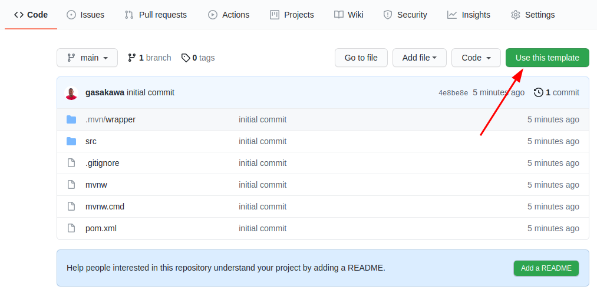
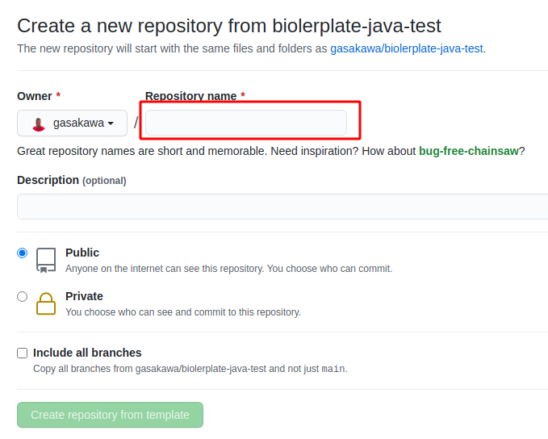

# Desafio Java - Spring Boot

Desenvolver uma API para um sistema para controle de finanzas pessoais:

- Pré-requisitos:
  ```
  * Utilizar spring boot para criar a API
  * Java 11
  * Maven
  ```
  
  ```
  * Desenvolver os recursos em API Rest que realizam operações bancárias com a entidade "accounts" a seguir:
  ```
  | Accounts | Tipo |
  |-|-|
  | account_id | integer |
  | user_id | integer |
  | balance | money |
  | income | money |
  | expense | money |

  ```
  * Tabela de "transactions" realizadas na "accounts"
  ```
  | Transactions | Tipo |
  |-|-|
  | transaction_id | integer |
  | account_id | integer |
  | value | money |
  | created_at | date |

  ```
  * Tabela de "categories" 
  ```
  | Categories | Tipo |
  |-|-|
  | category_id | integer |
  | name | varchar |
  | type | char (E - entrada ; S - saida) |

  ```
  * P.S.: Não é necessário realizar operações com a tabela users, mas é necessária a criação da tabela para mapeamento da relação com a account e enviar script de criação de pelo menos um user.
  ```

  | Users | Tipo |
  |-|-|
  | user_id | integer |
  | name | varchar |
  | email | varchar |

- O que esperamos como escopo mínimo:
  ```
  * Implementar path que cadastra uma entrada na conta;
  * Implementar path que cadastra uma saida na conta;
  * Implementar path que consulta o saldo em uma conta;
  * Implementar path que recupera o extrato de transações de uma conta;
  * Testes unitários na camada de serviços;
  ```

- O que vamos avaliar:
  ```
  * Seu código; 
  * Organização;
  * Boas práticas;
  ```


### Instruções
``` 
O projeto utiliza uma base de dados em memoria H2, se deseja utilizar outro DBMS 
(PostgreSQL ou MySQL), deve estar instalado e configurado no projeto 
antes da entrevista técnica.
```

0. Utilize este repositório como **template**, para "clonar" ele na sua própria conta do github.

1. Clique no botão "Use this template"



2. Escreva um nome para criar um novo repositório na sua conta do github, a partir do template selecionado.



3. Uma vez criado o repositório na sua conta do github, clone o mesmo na sua máquina.

4. Configure o seu IDE favorito.
   
5. Verifique que o teste unitário ```AccountServiceTest``` executa com sucesso.

6. Execute o comando ```mvn clean install```

7. Uma vez finalizado o build, execute o comando ```mvn spring-boot:run``` e verifique que a instância do tomcat inicia sem problemas.

8. Analise o código do projeto e se prepare para o **live coding**.


